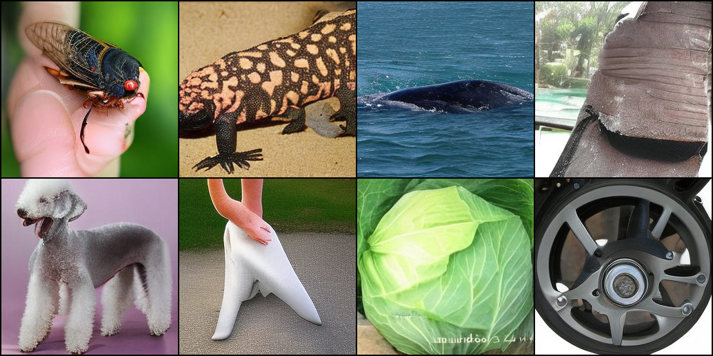
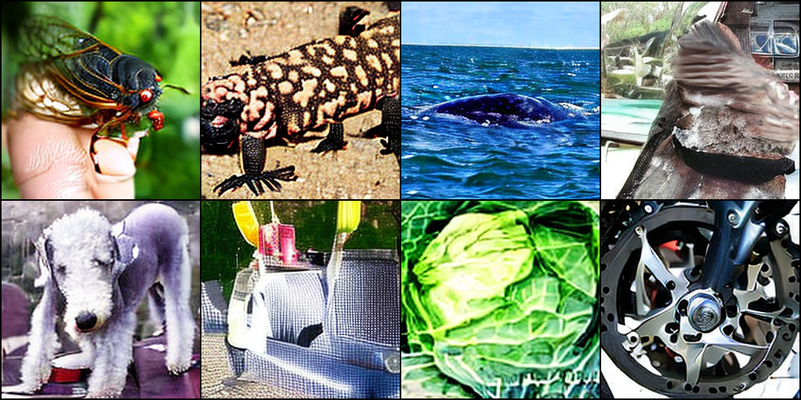
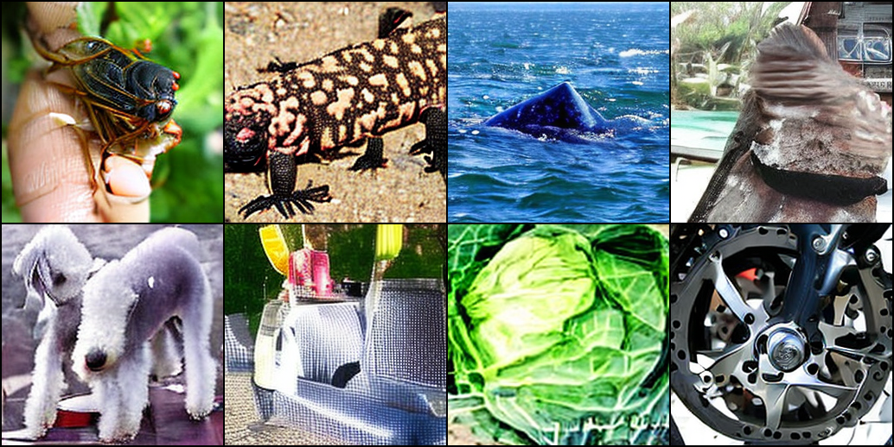
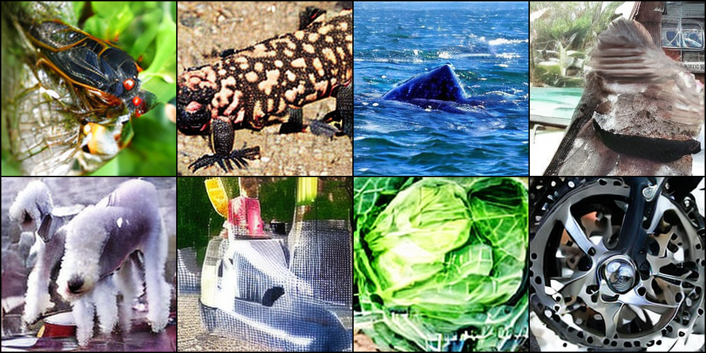
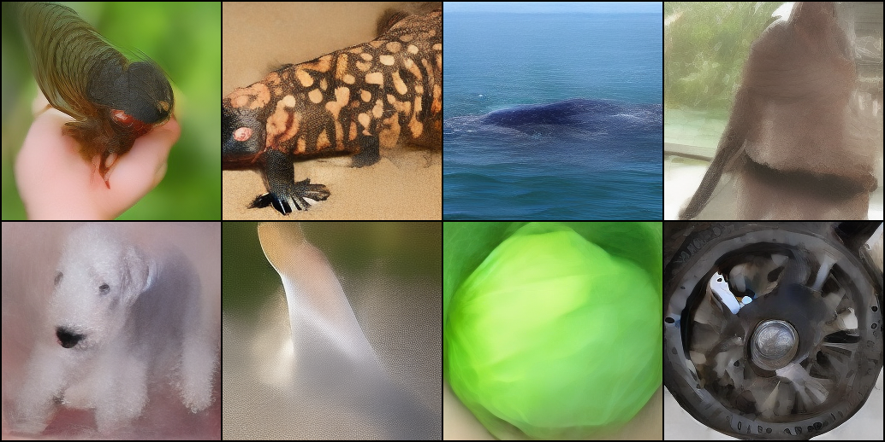
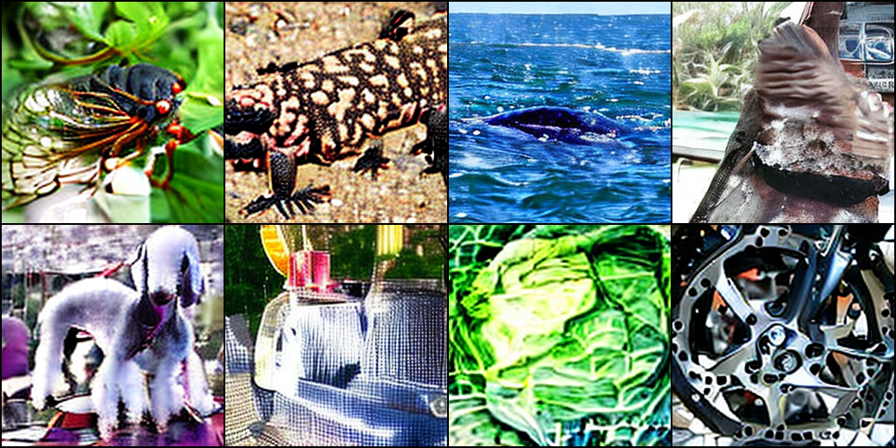
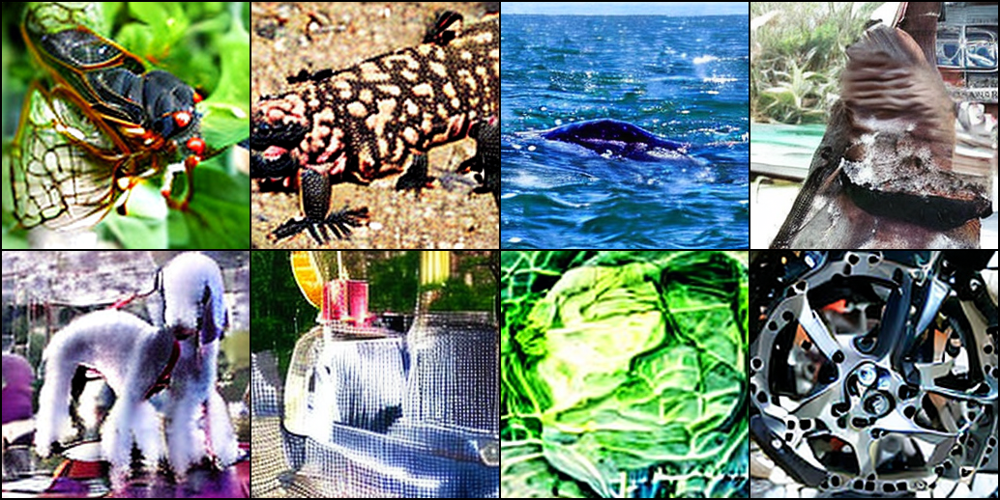

# reflow-dit

Implementing [rectified flow](https://arxiv.org/abs/2209.03003) on top of [fast-dit](https://github.com/chuanyangjin/fast-DiT) for few-step inference.

## Interative demo
It runs around 0.3 seconds per image on a single NVIDIA GeForce RTX 4090.

## Steps
* Download ImageNet256 dataset from Kaggle, with around 500,000 images, 11 GB .npy files after preprocessed by `extract_features.py`.
* Train DiT from scratch by `train.py`, with the speed around 0.55 steps/sec using DiT-XL/2 with 4x NVIDIA Quadro RTX 8000.
* After training from scratch in the previous step, we generate a new dataset by `sample_ddp.py` with 500,000 images using the trained DiT-XL/2 model with 50 steps of DDIM.
This new dataset is to train 1-rectified flow.
* Train 1-rectified flow by `train_rf.py`, the quality (especially the details) of few-step inference seems improved. 
But overall quality with 50 steps seems not as good as the original DiT with DDIM. That's where we can continue to improve.
* Repeat the last step to train 2-rectified flow by `sample_ddp_rf.py` and `train_rf.py`.
* To quickly test the model inference on a few classes, see `sample.py` and `sample_rf.py`

## Training DiT from scratch

<!-- * Our DiT generated samples, using DDIM with 250 steps, after 640 GPU hours of training from scratch:
 -->

<!-- * Our DiT generated samples, using DDIM with 250 steps, after training from scratch:
 -->

* Our final DiT generated samples, using DDIM with 50 steps, after training from scratch:

## Training 1-rectified flow

1-rectified flow version of DiT seems more robust with less steps compared to original DiT.

* Our final 1-rectified flow generated samples using 50 steps:

* 10 steps:

* 5 steps: (worse than 50 steps but overall similar)

* vs. DiT with DDIM 5 steps (way less details):

## Training 2-Rectified flow

2-rectified flow seems not improved compared to 1-rectified flow.

* 50 steps:

* 10 steps:

* 5 steps:

## Acknowledgement
* [fast-dit](https://github.com/chuanyangjin/fast-DiT)
* [rectified flow](https://github.com/gnobitab/RectifiedFlow)